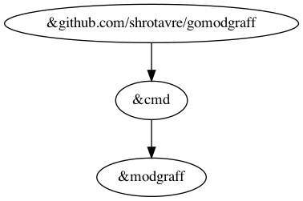

# gomodgraff  

Gomodgraff is a utility to draw relationship between packages inside a Go module/project.

## Installation
You can build the binary yourself using `make build` or you can just
prebuilt binary by downloading the latest releases from [release page](https://github.com/shrotavre/gomodgraff/releases).

Extract it anywhere and it'll be ready for use.

## Usage

~~~ bash
# Basic usages
$ ./gomodgraff --internal true --dir /path/of/local/go/project

# Show helps
$ ./gomodgraff -help
# Parameters
#   -dir string
#         target directory to draw dependency graph from (default ".")
#   -filename string
#         target filename to save to (default "gomodgraff")
#   -internal
#         should it print relationship between internal packages only (default false)
~~~

